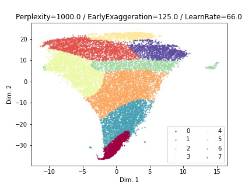
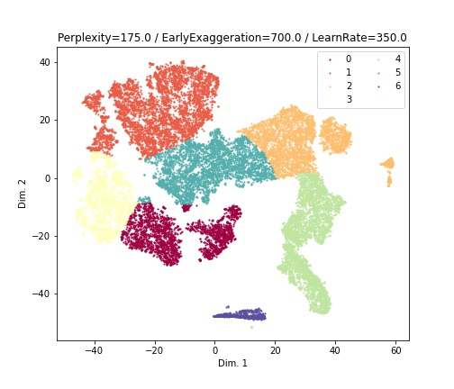

# DIBS: Data-Informed Behavioural Segmentation

## Summary
*DIBS* is a package built on top of DeepLabCut (commonly recognized as "DLC") that aims to 
automate and standardize animal behaviour recognition for video analysis.

Often times, human analysts are asked to gauge and record animal behaviours for an experiment,
but scoring between researchers can vary greatly due to differences in unavoidable subjective perspective. 
*DIBS* aims to reduce the human-error element 
from the equation and instead uses a data-centric approach to cluster similar 
behaviours together and then standardize the behaviour recognition process. By having just one set 
of "rules" (more on this later) that DIBS uses to recognize distinct behaviours, it reduces instances of 
researcher error due to things like overlooked behaviours or split decisions on short-duration behaviours. 
On top of all this, *DIBS* comes replete with a web app platform that allows for
non-programmers to utilize the package without any prior programming knowledge.
Just follow the package installation instructions, the usage guide, and enjoy!

Note: *DIBS* is currently in a functional state, but is also a work-in-progress. If you notice any bugs
or have any questions, do not hesitate to reach out to our lab at HowlandLab@gmail.com. 
Thank you for your support.

-------------------------------------------------------------------------------

## Installation & Setup
- Ensure that you have Python installed
  - To ensure that you have Python installed, try running: `python --version`
  - Make sure that you have Python 3.7 or newer installed
- Ensure that you have Anaconda installed
  - You can ensure you have conda installed by running: `conda --version`
  - If you do not have Anaconda installed, it is a good idea 
- Run the following command to create your environment: `conda create -n dibs && conda activate dibs`
- Copy and paste all commands from [CONDA_ENV_COMMANDS.txt](./CONDA_ENV_COMMANDS.txt) into your 
  command line one at a time to download all necessary packages

-------------------------------------------------------------------------------

## Usage

### Web app option: Streamlit

To run normally, run: `streamlit run main.py streamlit`

To run the Streamlit app with an existing Pipeline file, run:

  - `streamlit run main.py streamlit -- -p '/absolute/path/to/existing.pipeline'`
    - This works with any operating system so long as the path is absolute, and
    - **Ensure that the path to the pipeline is in single quotes** so that it is evaluated 
      as-is (or else Windows users may encounter problems with backslashes being evaluated 
      and other weird character quirks)

### Bare package use option (WIP)

Currently, the process for importing *DIBS* as a modular package is still being developed. 
Stay tuned for more information.

For clear examples on how best to use the DIBS Pipeline, open a local instance of `jupyter notebook`
and open the [Try-Me! notebook](./notebooks/TryMe.ipynb).

### Configuring runtime and default variables

A user may configure these variables at [config.ini](./config.ini).

Since some labs have different naming conventions for items that they track with DLC, it is
likely that you will need to change some variables within config.ini

_

To see the FAQ, read here: [FAQ.md](./FAQ.md)

-------------------------------------------------------------------------------

## Parameter Tuning

It is important to note that the colouring of the clustering is *not* indicative of the quality of clustering. 
As well, distance between clusters is *not* indicative of quality of clustering.
**Good clustering is qualified by how distinct each group of points is.** 

Here is an example of **bad clustering**:

Notice how indistinct the clustering is between like groups. In this case, it doesn't matter 
how many colours are used to identify the clusters; the clustering 
between groups is not distinct and therefore the t-SNE parameters are suboptimal.

--

Below is an example of **better clustering**:

Notice how the groups are much more distinct -- this is indicative of an improved set 
of t-SNE parameters. Changing the number of GMM clusters present will not alter 
the clustering arrangement, but can improve the clarity of
how the clusters are assigned. In this case, it looks as though increasing 
the number of cluster assignments (in the GMM parameters set) will 
improve the visual clarity between clusters, but optimizing the t-SNE parameters for 
distinctness of clustering should take priority. 

-------------------------------------------------------------------------------

## Tests

To run the test suite, execute the following command: `python -m unittest discover DIBS/tests`

Note: you may see much more debug information during each test than you 
were expecting. Each user can change their threshold for logging output by altering
the variables in [config.ini](config.ini) under the **[TESTING] section** 
(namely the [TESTING][STREAM_LOG_LEVEL] variable). Changing the level of output from 
**DEBUG** to **WARNING** will greatly reduce the amount of output to stdout.

------------------------------

### Spare words. Ignore the below.

- Run the following command to automate creation of the environment: `conda env create -n dibs -f env_windows.yml`